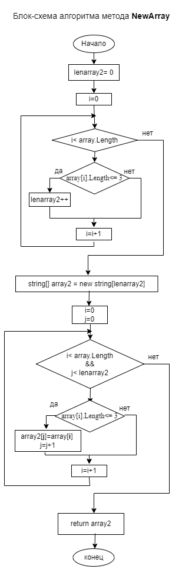

*Для формирования нового массива выделен метод NewArray. В этом методе выполняем просмотр исходного массива дважды – первый раз определяем количество элементов нового массива, удовлетворяющих условию, второй раз заполняем массив.* 

